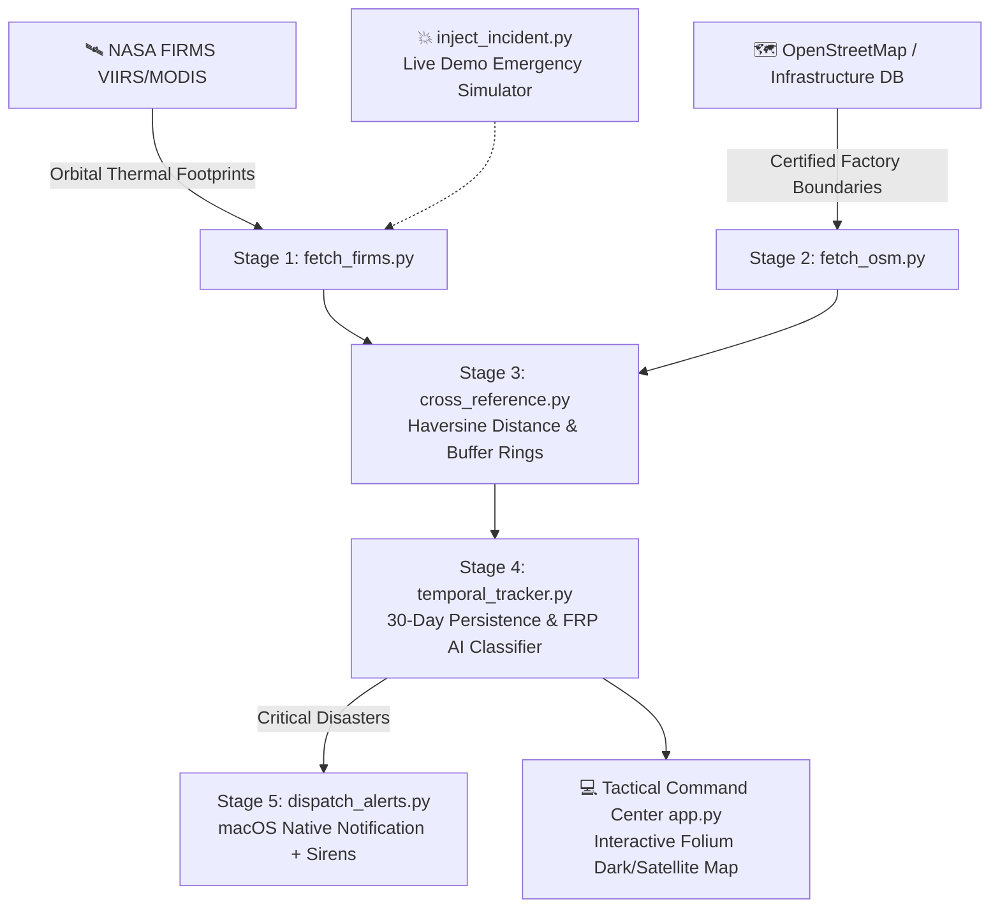

# 🛰️ SIH26162: AI-Based Detection & Classification of Industrial Fires

An enterprise-grade geospatial command center designed for the **Smart India Hackathon (Problem Statement SIH26162)**. This platform cross-references live satellite thermal anomalies against manufacturing infrastructure layouts to automatically isolate controlled flare stacks from uncontrolled structural disasters.

---

## 🌟 The Core Innovation: Zero False Positives

| Hotspot Type | Spatial Context | Temporal Persistence | Heat Output (FRP) | System Action |
| :--- | :--- | :--- | :--- | :--- |
| **🏭 Controlled Flare Stack** | Inside Industrial Refinery Buffer | Persistent ($\ge 10$ of 30 days) | Normal Baseline (15–150 MW) | **Safe** (Monitored Telemetry) |
| **🚨 Critical Industrial Disaster** | Inside Chemical / Factory Zone | Sudden emergence or surge | Extreme Spikes ($> 250$ MW) | **ALPHA-RED SIREN ALARM** |
| **🌲 Vegetation / Wildfire** | Outside Industrial Buffer | Transient open terrain | Variable (5–80 MW) | **Forestry Dept Notice** |

---

## 🏗️ Architecture & Pipeline Flow



---

## 🚀 Quickstart (1-Minute Setup)

### Option 1: One-Click Launch (Recommended)
Simply execute the launch script from your terminal:
```bash
./run.sh
```
This automatically sets up an isolated virtual environment, installs dependencies, verifies the data pipeline, and opens the dashboard at `http://localhost:8501`.

### Option 2: Manual Setup
```bash
# 1. Create and activate a Python virtual environment
python3 -m venv .venv
source .venv/bin/activate

# 2. Install lightweight dependencies
pip install -r requirements.txt

# 3. Execute the full detection pipeline
python pipeline.py

# 4. Launch the Tactical Command Center
streamlit run app.py
```

---

## 🧪 Live Hackathon Demonstration Scenarios

During your presentation to the jury, you can demonstrate real-time response using either the Streamlit UI or the CLI:

1. **Simulate Chemical Explosion Detonation**:
   ```bash
   python inject_incident.py explosion
   python pipeline.py --reuse
   ```
   *Result:* Instantly triggers an Alpha-Red desktop notification, siren alarm, red map marker, and hazmat fleet deployment recommendation.

2. **Reset to Routine Baseline**:
   ```bash
   python inject_incident.py baseline
   python pipeline.py --reuse
   ```
   *Result:* Shows all refineries within standard operational green thresholds with zero false alarms.

---

## 📁 Repository Structure

- `app.py`: Interactive Streamlit Command Center with Folium geospatial map, hazard buffers, and fleet logistics.
- `pipeline.py`: Master orchestrator running all 5 stages in sequence.
- `fetch_firms.py`: Satellite data ingestion from NASA FIRMS with fallback to calibrated Indian industrial hotspots.
- `fetch_osm.py`: Industrial zoning mapper querying Overpass API or high-precision Indian factory catalog.
- `cross_reference.py`: Spatial proximity engine computing Haversine distance to industrial perimeters.
- `temporal_tracker.py`: AI & temporal classifier distinguishing routine flares from disasters and wildfires.
- `dispatch_alerts.py`: Emergency dispatcher pushing native macOS desktop notification cards and siren audio.
- `inject_incident.py`: Interactive crisis injector for live presentations.
- `data_processor.py`: Space-time deduplication and satellite noise filtering utilities.
- `requirements.txt`: Clean, cross-platform dependencies.
- `run.sh`: Automated one-click bootstrap script.
